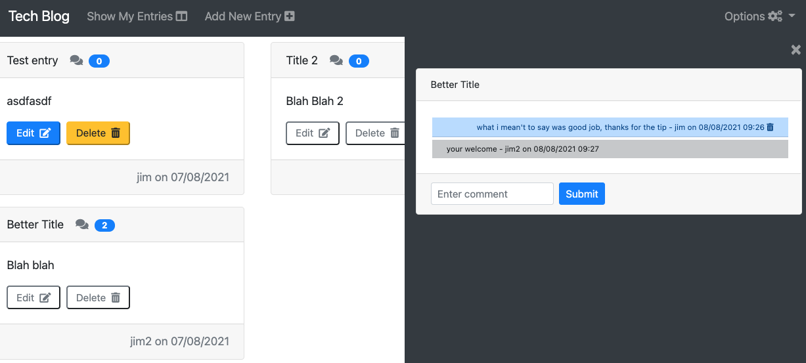

# Tech Blog      

# Table of Contents
- [Project Description](#project-description)
- [Installation Instructions](#installation-instructions)
- [Usage](#usage)
- [Screenshot](#screenshot)
- [How To Contribute](#how-to-contribute)
- [Technology](#technology)
- [Questions](#questions)
- [License](#license)

# Project Description
This small [web application](https://tech-blog-jps.herokuapp.com/) allows the user to create/update/delete and view simple tech blog entries (title and content) that are stored persistently on a webserver in a MySQL database.

The user can access all the existing blog entries and their comments, but only when logged into the site through the login screen.

A new user can register and create a login with the Options menu, and then be able to enter their own entries and comment on other entries.

If the user is idle, the session expires in 30 minutes.

# Installation Instructions

1.  Install [node.js](http://nodejs.org)
2.  Using the installed Node Package Manager `npm`, execute `npm install` to in the `frontend` directory, and again in the `backend` directory.

# Usage

1. To execute the application, use a command line interface (CLI) such as terminal (or in windows command), goto the `backend` directory and execute `npm run start` or alternatively `node src/server.ts`
2. Open a web browser and navigate to the homepage of the web application ([default is](http://localhost:3000))

# Screenshot

## How to contribute

Please access the [Questions](#questions) section to send me an email, or access the repository link if you wish to help contribute to this project.

# Technology

1. [Node.js](http://nodejs.org)
2. NPM
4. [Moment](https://npmjs.com/package/moment)
5. [React](https://www.npmjs.com/package/react)
6. [BCrypt](https://www.npmjs.com/package/bcrypt)
7. [Bootstrap](https://getbootstrap.com/)
8. [Webpack](https://www.typescriptlang.org/)
9. [Babel](https://babeljs.io/)
10. [MySQL](https://www.mysql.com/)
11. [MySQL2](https://www.npmjs.com/package/mysql2)
12. [DotENV](https://www.npmjs.com/package/dotenv)
13. [Git-Crypt](https://github.com/AGWA/git-crypt)
14. [Express](https://www.npmjs.com/package/express)
15. [Sequelize](https://www.npmjs.com/package/sequelize)
16. [Passport](https://www.npmjs.com/package/passport)
17. [Socket.io](https://socket.io/)
18. [Connect Session Sequelize](https://www.npmjs.com/package/connect-session-sequelize)
19. [Typescript](https://www.typescriptlang.org/)
20. [ts-node](https://github.com/TypeStrong/ts-node)
21. [tsc-watch](https://www.npmjs.com/package/tsc-watch)
22. [ts-loader](https://github.com/TypeStrong/ts-loader)

# Questions

>  **Direct your questions about this project to:**
>
>  *GitHub:* [Github Project Link](https://github.com/jsharples777/tech-blog-jps)
>
>  *Email:* [jamie.sharples@gmail.com](mailto:jamie.sharples@gmail.com)

# License

### [MIT License](https://opensource.org/licenses/MIT)
A short and simple permissive license with conditions only requiring preservation of copyright and license notices. Licensed works, modifications, and larger works may be distributed under different terms and without source code.
